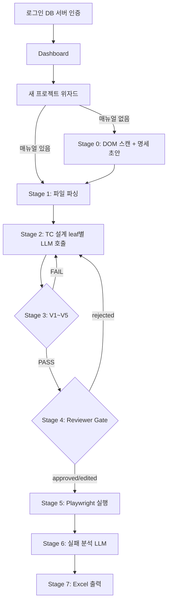

# AWT 아키텍처

> **AWT** = AI-driven Web Testing. ISO/IEC 25023 기반 웹 제품 시험을 TC 설계·자동 실행·결과 판정까지 end-to-end 자동화하는 Windows 데스크탑 앱.

---

## 1. 한눈에 보는 전체 흐름

```
[로그인 DB 서버 인증]
      │
      ▼
┌─────────────────────────────────────────────────────────────────┐
│                  AWT Desktop App (.exe, 로컬)                    │
│                                                                 │
│  입력: URL + (선택) 매뉴얼 / 기능리스트 / 결함 샘플                │
│                                                                 │
│  Stage 0: DOM 스캔 + 기능 명세 초안   ← Playwright (local)        │
│  Stage 1: 파일 파싱·정규화                                        │
│  Stage 2: TC 설계 (leaf별 LLM 호출)   ← Anthropic API            │
│  Stage 3: V1~V5 검증 (로컬) + 재생성 (LLM)                       │
│  Stage 4: ★ Reviewer Gate (사용자 A/E/R/P 결정) ★                │
│  Stage 5: 자동 실행                   ← Playwright (local)       │
│  Stage 6: 실패 분석                   ← Anthropic API            │
│  Stage 7: Excel 산출                                            │
│                                                                 │
│  산출: tc_final.xlsx + 실행 로그 + 메트릭                         │
└─────────────────────────────────────────────────────────────────┘
```

**Mermaid:**



---

## 2. 데스크탑 앱 구조 (D34·D35·D37)

```
AWT/
├── app/                            ← 프로덕션 앱 소스
│   ├── main.py                     ← 진입점 (PyQt5/PySide6)
│   ├── auth/
│   │   └── db_client.py            ← DB 서버 접속·인증 (D40)
│   ├── ui/
│   │   ├── login_window.py
│   │   ├── dashboard.py
│   │   ├── wizard.py               ← URL·파일 선택
│   │   ├── pipeline_view.py        ← Stage 진행 상황
│   │   └── reviewer_gate.py        ← Stage 4 A/E/R/P 테이블
│   ├── core/
│   │   ├── orchestrator.py         ← Stage 0~7 흐름 제어 (D43)
│   │   ├── stage0_dom_scan.py
│   │   ├── stage1_ingest.py
│   │   ├── stage2_tc_design.py
│   │   ├── stage3_verify.py
│   │   ├── stage5_execute.py
│   │   ├── stage6_enhance.py
│   │   └── stage7_output.py
│   ├── api/
│   │   ├── llm_client.py           ← Anthropic API 래퍼 (D38)
│   │   └── call_contracts.py       ← Call Contract 로더
│   ├── tools/
│   │   ├── excel_builder.py
│   │   ├── file_parser.py          ← PDF/DOCX/XLSX
│   │   └── cache.py                ← 입력 해시 기반 LLM 결과 캐시 (D41)
│   └── config/
│       ├── settings.py             ← API 키 암호화 저장 (D42)
│       └── db_config.py
├── prompts/                        ← LLM Call 프롬프트 템플릿
│   ├── dom_spec.md
│   ├── tc_design.md
│   ├── tc_regen.md
│   └── failure_analysis.md
├── data/runs/<run-id>/             ← 실행별 산출 동결 (불변)
│   ├── dom-scan/
│   ├── ingest/
│   ├── tc_raw.xlsx
│   ├── tc_verified.xlsx
│   ├── tc_gated.xlsx
│   ├── tc_executed.xlsx
│   └── tc_final.xlsx
├── installer/                      ← 설치 패키지 (Inno Setup)
└── doc/                            ← 본 설계 문서
```

---

## 3. Stage별 책임

| Stage | 입력 | 처리 | 출력 | LLM 사용 |
|---|---|---|---|---|
| 0 (선택) | URL + 인증정보 | Playwright DOM 스캔 → LLM 명세 합성 | `feature-spec-draft.md` | ✓ DOM_SPEC |
| 1 | 매뉴얼·기능리스트 파일 | 파일 파싱·정규화 | 텍스트 + leaf 목록 | ✗ |
| 2 | leaf 목록 + 매뉴얼 발췌 | leaf 1개씩 LLM 호출 | `tc_raw.xlsx` | ✓ TC_DESIGN |
| 3 | tc_raw | V1~V5 검증 + 실패 시 재호출 | `tc_verified.xlsx` | ◐ TC_REGEN (실패 시) |
| 4 | tc_verified | 사용자 A/E/R/P 결정 (UI) | `tc_gated.xlsx` | ✗ |
| 5 | tc_gated (approved/edited만) | Playwright 자동 실행 | `tc_executed.xlsx` | ✗ |
| 6 | 실패 TC | LLM 실패 원인 4축 분석 | `tc_final.xlsx` | ✓ FAILURE_ANALYSIS |
| 7 | tc_final | 보고서 Excel 합성 | `report/` 폴더 | ✗ |

**V1~V5 검증 규칙 (Stage 3, 모두 로컬 처리):**
- V1: 필수 컬럼(9개) 채워짐 — regex
- V2: source_quote가 매뉴얼에 실재 (또는 INFERRED 마킹) — grep
- V3: INFERRED 비율 ≤ 임계 (PoC 후 정량 결정)
- V4: 7기법 분포 (happy_path ≤ 50% 등)
- V5: 모든 leaf에 최소 1개 TC

---

## 4. Stage 0 — DOM 스캔 + 명세 초안 합성 (D32·D33)

**활성 조건:** 매뉴얼/기능리스트가 없거나 빈약할 때.

**처리:**
1. Playwright로 URL 접속
2. 인증 필요 시: 로그인 시퀀스 (아이디/비번 실행 시점 입력, 하드코딩 금지)
3. 페이지 스캔 (depth ≤ 2, 최대 30 페이지)
4. DOM 요소 수집·필터: `id / name / type / placeholder / aria-label / text / href` 만 추출
5. LLM 호출 (`DOM_SPEC`) → 기능 명세 초안 생성
6. `data/runs/<run-id>/dom-scan/feature-spec-draft.md` 저장

**보안:** 인증 세션은 메모리 유지, 외부 저장 금지.

---

## 5. LLM 연동 (D38) — Stateless API 호출

- **모든 호출은 독립** — 대화 히스토리 미전달
- **각 호출 = Call Contract 1개** — 상세는 [02-llm-contracts.md](02-llm-contracts.md)
- **호출 지점 4종:** `DOM_SPEC` / `TC_DESIGN` / `TC_REGEN` / `FAILURE_ANALYSIS`
- **JSON Schema 강제** — 자유 텍스트 응답 금지
- **캐시** — 입력 SHA-256 키로 동일 호출 재사용

**예상 토큰 (10 leaf 기준):** 약 111,500 tok
**예상 비용:** claude-3-5-sonnet 기준 약 $0.60 / 실행

---

## 6. 로컬 Playwright (D39)

- Python `playwright` 라이브러리 사용 (Claude Code MCP 미사용)
- 설치 패키지에 `playwright install chromium` 포함 → chromium 바이너리 로컬 저장
- Stage 0(DOM 스캔)과 Stage 5(자동 실행) 둘 다 동일 라이브러리 사용

```python
# 의사코드
from playwright.sync_api import sync_playwright

with sync_playwright() as p:
    browser = p.chromium.launch(headless=True)
    page = browser.new_page()
    page.goto(url)
    # ... 단계별 액션
    browser.close()
```

---

## 7. 인증 (D40)

- 앱 실행 → 로그인 화면 → 중앙 DB 서버 직접 접속
- 자격증명 검증 (SHA-256 해시 비교)
- 검증 성공 시 로컬 세션 토큰 발급 → 메모리 유지
- 처리(Stage 0~7)는 모두 로컬, 서버 통신 없음

**DB 최소 스키마:**
```sql
CREATE TABLE users (
    id          INT PRIMARY KEY AUTO_INCREMENT,
    username    VARCHAR(64) UNIQUE NOT NULL,
    pw_hash     VARCHAR(64) NOT NULL,
    is_active   BOOLEAN DEFAULT TRUE,
    created_at  DATETIME DEFAULT NOW()
);
```

---

## 8. API 키 관리 (D42)

- 사용자별 개인 Anthropic API 키
- 앱 설정 화면에서 입력 → 머신 고유값 기반 Fernet 암호화 → 로컬 config 파일 저장
- 키는 서버로 전송되지 않음
- 키 검증은 첫 API 호출 시점에 수행

---

## 9. 단계별 산출 동결

| Stage | 동결 파일 | 위치 |
|---|---|---|
| Stage 0 종료 | `feature-spec-draft.md` | `data/runs/<run-id>/dom-scan/` |
| Stage 1 종료 | 추출 결과 | `data/runs/<run-id>/ingest/` |
| Stage 2 종료 | `tc_raw.xlsx` | `data/runs/<run-id>/` |
| Stage 3 종료 | `tc_verified.xlsx` | `data/runs/<run-id>/` |
| Stage 4 종료 | `tc_gated.xlsx` | `data/runs/<run-id>/` |
| Stage 5 종료 | `tc_executed.xlsx` | `data/runs/<run-id>/` |
| Stage 6 종료 | `tc_final.xlsx` | `data/runs/<run-id>/` |
| 모든 LLM 호출 | prompt 전문 + 응답 + 모델 버전 | `data/runs/<run-id>/llm/` |

→ 각 단계 산출이 git처럼 누적 보관되어 audit trail 완비.

---

## 10. Phase 로드맵

| 단계 | 내용 | 상태 |
|---|---|---|
| **PoC** | Claude Code 환경에서 prompt 품질 검증 (α/β/γ) | α 완료, β 대기 |
| **Phase 1** | Desktop App 본 개발 (Stage 0~7 + 인증 + UI) | PoC 완료 후 |
| **Phase 2** | RAG (익명화 결함이력) + multi-agent + 25023 메트릭 % 자동 | Phase 1 안정화 후 |
| **Phase 3** | 25059(AI 제품) 도입 + multi-browser + self-healing | 시험소 정책 결정 후 |

---

## 11. 미결 설계 항목

| 항목 | 결정 시점 |
|---|---|
| UI 프레임워크 (PyQt5 vs PySide6) | 앱 개발 시작 시 |
| DB 서버 스택 (MySQL/PostgreSQL) | 인프라 확정 시 |
| 설치 패키지 도구 (Inno Setup vs NSIS) | 빌드 단계 |
| API 호출 재시도 정책 | Phase 1 개발 중 |
| 앱 업데이트 메커니즘 | Phase 1 후반 |
| 실제 OSS 시험 대상 선정 | PoC-γ 완료 후 |
