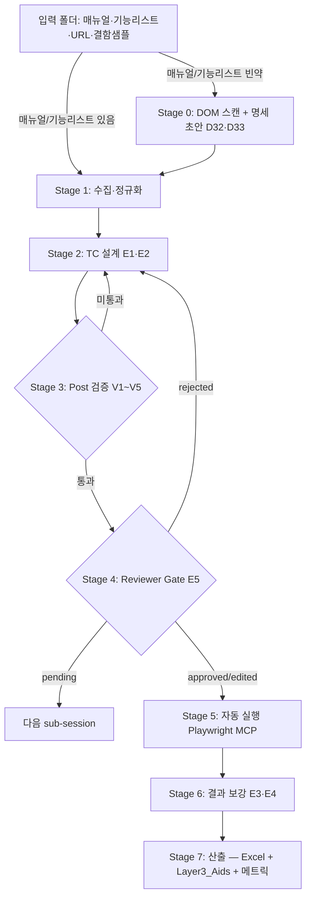

# AWT High-Level Architecture (Standalone, D25)

**목적:** AWT의 전체 흐름을 한 페이지로 파악. 외부 설명·인수 인계 시 시작점.
**범위:** Phase 1 (E1·E2·E3·E4·E5). Phase 2~3 컴포넌트는 *예정 영역*으로 표시.
**전제:** D25 — AWT는 standalone skill. 외부 skill 호출 없음.

---

## 1. 한 그림 요약

```
┌──────────────────────────────────────────────────────────────────────────────┐
│                          INPUT  (사용자가 폴더에 배치)                          │
│                                                                              │
│   📄 매뉴얼 (PDF/Word/PPT) ── 있으면 그대로 투입                              │
│   📊 기능리스트 (Excel, 대중소분류) ── 있으면 그대로 투입                      │
│   🌐 URL (텍스트) ── Stage 0 또는 Stage 1 투입                                │
│   🐛 결함 샘플 (품질특성별 문서)                                               │
└──────────────────────────────────────────────────────────────────────────────┘
                                  │
                                  ▼
┌──────────────────────────────────────────────────────────────────────────────┐
│   AWT  —  Stage 0: DOM 스캔 + 기능 명세 초안 합성  (D32·D33)  [선택 단계]    │
│                                                                              │
│   ※ 매뉴얼·기능리스트가 없거나 빈약할 때 활성화                                │
│                                                                              │
│   • Playwright MCP로 URL 접속                                                 │
│     - 인증 필요 시: 아이디/비번 입력 → 세션 유지 후 스캔 (D33)                 │
│   • DOM 스캔: form·input·button·nav·modal·table 수집                         │
│   • 페이지별 기능 후보 추출 → feature-spec-draft.md 자동 생성                  │
│   • Stage 1 Ingest의 "매뉴얼 + 기능리스트" 대체 입력으로 투입                  │
└──────────────────────────────────────────────────────────────────────────────┘
                                  │
                                  ▼
┌──────────────────────────────────────────────────────────────────────────────┐
│              AWT  —  Stage 1: 수집·정규화 (Ingest)                          │
│                                                                              │
│   • 매뉴얼 → 텍스트 + 페이지 메타 (skill: pdf / docx)                          │
│   • 기능리스트 → leaf 분류 추출 + ID 부여 (skill: xlsx)                        │
│   • URL → DOM 인덱스 + 스크린샷 (Claude Code Playwright MCP)                  │
│   • 결함 샘플 → 패턴 추출 + prompt 컨텍스트 주입                                │
└──────────────────────────────────────────────────────────────────────────────┘
                                  │
                                  ▼
┌──────────────────────────────────────────────────────────────────────────────┐
│                AWT  —  Stage 2: TC 설계 (E1·E2)                              │
│                                                                              │
│   • source_quote + requirement_id 강제                                       │
│   • 7가지 설계 기법 분산 (happy/equiv/bound/neg_basic/neg_deep/state/cross)   │
│   • 기능별 최소 TC 수 강제                                                    │
│   • TC Excel 산출 (시험소 표준 양식)                                          │
└──────────────────────────────────────────────────────────────────────────────┘
                                  │
                                  ▼
┌──────────────────────────────────────────────────────────────────────────────┐
│           AWT  —  Stage 3: Post 검증·보강  (V1~V5)                           │
│                                                                              │
│   V1: 필수 컬럼     V2: source_quote grep   V3: INFERRED ≤ 5%                │
│   V4: 기법 분포      V5: 누락 기능                                            │
│                                                                              │
│   미통과 → 자동 재호출 (Stage 2로 복귀, 최대 3회)                              │
│   통과 → confidence·INFERRED 마킹 보강                                       │
└──────────────────────────────────────────────────────────────────────────────┘
                                  │
                                  ▼
┌──────────────────────────────────────────────────────────────────────────────┐
│              ★ Stage 4: Reviewer Gate (E5, D22 — 자동실행 이전)  ★           │
│                                                                              │
│   📋 Excel 시트  +  색상 정렬  +  confidence 기반 우선순위                     │
│                                                                              │
│   시험원 결정: approved / edited / rejected / pending                         │
│   • rejected → Stage 2로 복귀 (재생성)                                         │
│   • pending  → 다음 sub-session                                                │
│   • approved + edited → Stage 5로                                              │
└──────────────────────────────────────────────────────────────────────────────┘
                                  │
                                  ▼
┌──────────────────────────────────────────────────────────────────────────────┐
│         AWT  —  Stage 5: 자동 실행 (Playwright MCP)                          │
│                                                                              │
│   • 승인된 TC만 입력 (D23 selective rerun 기제)                                │
│   • Claude Code의 Playwright MCP 직접 호출 (D24)                              │
│   • steps 해석 → 브라우저 액션 → result + actual 채움                          │
└──────────────────────────────────────────────────────────────────────────────┘
                                  │
                                  ▼
┌──────────────────────────────────────────────────────────────────────────────┐
│              AWT  —  Stage 6: 결과 보강 (E3·E4)                              │
│                                                                              │
│   • oracle_reason 자동 기록                                                    │
│   • failure_reason 4축 (실제출력 / 차이 / 원인후보 / 재시도이력)                │
│   • exec_confidence 산정                                                       │
└──────────────────────────────────────────────────────────────────────────────┘
                                  │
                                  ▼
┌──────────────────────────────────────────────────────────────────────────────┐
│              AWT  —  Stage 7: 산출 (시험소 표준 양식)                         │
│                                                                              │
│   📊 시험 결과 Excel (시험소 표준 양식)                                       │
│   📊 결함 리포트 Excel                                                         │
│   📁 Layer3_Aids/ (시험원 보조 자료)                                           │
│   📈 data/metrics/<product>/<date>.json (메타 지표, Phase 2 메트릭 % 추가)    │
└──────────────────────────────────────────────────────────────────────────────┘
```

---

## 2. Mermaid 다이어그램 (렌더링 가능 환경용)



---

## 3. 컴포넌트 책임 분담 (Standalone)

| 컴포넌트 | 책임 | 비책임 |
|---|---|---|
| **사용자(시험원)** | 입력 폴더 준비, Stage 4 Gate 검토·결재, L3 시험 수행 | TC 직접 작성, 자동실행 수동 트리거 |
| **AWT (skill 본체)** | Stage 1~7 모든 단계의 orchestration + prompt + 검증 | 시험원 도메인 판정, L3 본격 수행 |
| **Claude Code MCP** | Playwright (브라우저 자동화), pdf/docx/xlsx 파일 처리 | 판정 |

> **D25 이후:** 외부 시험방법 skill은 *호출 흐름에 들어가지 않음*. 인터뷰로 학습한 시험방법론은 *AWT prompt에 내재화*.

---

## 4. AWT의 *물리적 형태*

### 4.1. Phase 1: Claude Code Skill

AWT는 *별도 실행 가능한 시스템*이 아니라 다음 셋의 조합:

| 형태 | 내용 | 위치 |
|---|---|---|
| **Skill 본체** | Claude Code skill 정의 + system prompt + 단계 orchestration | `SKILL.md` (최상위) |
| **Prompt 템플릿** | Stage별 E1·E2·E3·E4 prompt | `prompts/` |
| **검증·보강 스크립트** | V1~V5, confidence 산정, INFERRED 마킹, Excel 처리 | `tools/` |
| **분리 배포 sub-skill** | 일반화 가능한 도구 (DOM scanner, 익명화 등) | `skills/<name>/` |

→ AWT는 *prompt + 작은 도구의 묶음을 묶은 하나의 skill*. 단일 호출 / 단계별 호출 둘 다 가능.

### 4.2. Phase 2: Windows 독립 실행 앱 (D34·D35)

PoC 완료 + Skill 완성 후 **Python GUI 앱**으로 래핑:

| 항목 | 내용 |
|---|---|
| **UI 프레임워크** | PyQt5 또는 PySide6 (네이티브 Windows 스타일) |
| **LLM 연결** | Anthropic Python SDK 직접 호출 (`anthropic` 패키지) |
| **배포 형태** | PyInstaller → 단독 `.exe` (Claude Code 미설치 환경에서 실행 가능) |
| **Prompt 재사용** | `prompts/` 디렉터리 그대로 앱 내에 번들 |
| **배포 대상** | Windows 사용자 전체 (비기술자 포함) |

→ Skill 설계가 먼저 완성되어야 앱 UI 설계 가능. Skill ⊂ App: Skill이 Core, App은 Shell.

---

## 5. Phase별 컴포넌트 활성화

| 컴포넌트 | Phase 1 | Phase 2 | Phase 3 |
|---|---|---|---|
| Stage 0 DOM 스캔 (D32·D33) | ✓ (선택) | + 매뉴얼 자동 생성 고도화 | + 다중 페이지 크롤 |
| Stage 1 수집 | ✓ | + 자동 fetch (URL → 매뉴얼 검색) | — |
| Stage 2 TC 설계 (E1·E2) | ✓ | + 도메인 RAG 주입 | + 25059 prompt |
| Stage 3 Post 검증 (V1~V5) | ✓ | + mutation testing | + metamorphic |
| Stage 4 Reviewer Gate | ✓ | + 2단 결재 옵션 | + 자동 학습 사이클 |
| Stage 5 자동 실행 | ✓ | + multi-browser | + self-healing |
| Stage 6 결과 보강 (E3·E4) | ✓ | + 25023 메트릭 % 자동 | + 25059 분포 평가 |
| Stage 7 산출 | ✓ | + 결함 리포트 자동화 | + differential 비교 |
| Multi-agent 분업 | — | ✓ | + 제품군별 specialized |
| RAG | (시드만) | ✓ | + 익명화 자동 |
| Differential testing | — | — | ✓ |

---

## 6. 데이터·상태 흐름의 *동결 단위*

각 단계에서 *동결되는 산출물*을 명시 (P1 — AI TC는 동결된 산출물):

| 단계 | 동결 산출 | 보관 위치 | 변경 가능성 |
|---|---|---|---|
| Stage 0 종료 | feature-spec-draft.md (DOM → 명세 초안) | `data/runs/<run-id>/dom-scan/` | 불변 |
| Stage 1 종료 | 추출된 매뉴얼·기능리스트·DOM 인덱스 | `data/runs/<run-id>/ingest/` | 불변 |
| Stage 2 종료 | 원 TC Excel | `data/runs/<run-id>/tc_raw.xlsx` | 불변 |
| Stage 3 종료 | 보강 TC Excel | `data/runs/<run-id>/tc_verified.xlsx` | 불변 |
| Stage 4 종료 | Gate 결정 반영 Excel | `data/runs/<run-id>/tc_gated.xlsx` | 불변 |
| Stage 5 종료 | 실행 결과 포함 Excel | `data/runs/<run-id>/tc_executed.xlsx` | 불변 |
| Stage 6 종료 | 보강 결과 Excel | `data/runs/<run-id>/tc_final.xlsx` | 불변 |
| Stage 7 종료 | 보고서·메트릭 | `data/runs/<run-id>/report/` | 불변 |
| Prompt 호출 메타 | 모든 호출의 prompt 전문 + 모델 버전 | `data/prompts/<run-id>/` | 불변 (audit) |

→ *각 단계 산출이 git처럼 누적 보관*되어 audit trail 완비.

---

## 7. *AWT를 standalone으로 만든 효과*

| 항목 | Wrapper (이전 가정) | Standalone (D25) |
|---|---|---|
| 시험원의 visibility | 외부 skill black box로 제한 | 모든 단계 직접 관찰 가능 |
| 디버깅 | 외부 skill 안에서 발생 | AWT 내부에서 모두 관찰 |
| Prompt 충돌 위험 | 있음 (Q-PA-4) | 없음 (단일 소유) |
| Excel 컬럼 충돌 | 있음 (Q-PA-5) | 없음 |
| 외부 협조 의존 | 있음 (다른 엔지니어 호출 필요) | 없음 |
| 시험소 차원 정책 호환 | 검토 필요 | 개인 R&D로 시작 가능 |
| Phase 2~3 진화 자유도 | 외부 skill 변경에 영향 | AWT 단독 진화 |

---

## 8. 주요 인터페이스

### 8.1. AWT ↔ 사용자

- 입력 폴더 한 곳에 자료 배치 → AWT 호출
- Stage 4 Gate에서 Excel 직접 검토·수정·결재
- Stage 7 결과를 직접 인수

### 8.2. AWT ↔ Claude Code MCP

- **Playwright MCP**: Stage 0 DOM 스캔 (+ 인증 시퀀스), Stage 5 자동 실행
- **pdf / docx / xlsx 스킬**: 파일 처리 (Stage 1·7)

### 8.3. AWT ↔ 데이터

- `data/runs/<run-id>/` 폴더에 모든 단계 산출 누적
- `data/prompts/<run-id>/` 모든 prompt + 모델 버전 메타

---

## 9. *AWT를 사용하지 않으면 어떻게 되나* (가치 정량화)

| 항목 | AWT 없음 (수동) | AWT 적용 |
|---|---|---|
| TC 신뢰도 | "믿어야 하는지 모르겠음" | source_quote로 5초 검증 |
| CRUD 편향 | 100~200 TC, CRUD 위주 | 200~500 TC, 7가지 기법 분산 |
| 실패 원인 파악 | 직접 확인해야 함 | failure_reason 4축 자동 |
| Reviewer 워크플로 | 부재 | Gate에서 시간 budget 통제 |
| 25023 메트릭 % | 측정 안 함 | Phase 2 자동 계산 |
| 시험원 L3 시간 | 10% 가설 | 60% 가설 |

---

## 10. 후속 문서 안내

- `03-data-flow.md` — 각 입력의 변환 과정 상세
- `05-prompt-augmentation.md` — Stage 2의 E1·E2 prompt 본문 (※ "augmentation" 이름은 D25 이전 잔재. 내용은 그대로 AWT의 핵심 prompt)
- `06-poc-validation-plan.md` — PoC-α/β/γ 단순 모드
- `00-existing-method-interview.md` — 기존 skill 인터뷰 (*reference material*)
- `00b-gap-analysis.md` — AWT의 design target (재해석됨)
